# Documentation CI/CD — GitHub Actions

Guide de référence pour les **workflows GitHub Actions** du projet **M-Motors LLD** : déclencheurs, enchaînement des jobs, secrets, variables, environments GitHub et procédure de configuration initiale du dépôt.

**Fichiers workflows :** `.github/workflows/`  
**Complément :** [docs/k8s/README.md](../k8s/README.md) (cluster, Kustomize), [docs/development/us-11-06-sast-dast.md](../development/us-11-06-sast-dast.md) (SAST/DAST)

---

## Sommaire

1. [Vue d’ensemble du pipeline](#1-vue-densemble-du-pipeline)
2. [Inventaire des workflows](#2-inventaire-des-workflows)
3. [Workflow réutilisable `ci.yaml`](#3-workflow-réutilisable-ciyaml)
4. [Déploiements par environnement](#4-déploiements-par-environnement)
5. [Workflows sécurité et qualité](#5-workflows-sécurité-et-qualité)
6. [Rollback manuel](#6-rollback-manuel)
7. [Secrets, variables et environments](#7-secrets-variables-et-environments)
8. [Procédure : configurer le dépôt GitHub](#8-procédure--configurer-le-dépôt-github)
9. [Procédure : préparer les kubeconfig](#9-procédure--préparer-les-kubeconfig)
10. [Procédure : SonarCloud (SAST)](#10-procédure--sonarcloud-sast)
11. [Procédure : Slack](#11-procédure--slack)
12. [Images Docker et GHCR](#12-images-docker-et-ghcr)
13. [Dépannage fréquent](#13-dépannage-fréquent)
14. [Checklist de mise en service](#14-checklist-de-mise-en-service)

---

## 1. Vue d’ensemble du pipeline

```mermaid
flowchart TB
  subgraph dev_flow [DEV — branche develop]
    D1[Push backend/frontend] --> D2[ci.yaml]
    D2 --> D3[deploy-dev]
    D3 --> D4[Namespace dev]
  end

  subgraph stg_flow [STAGING — branche main]
    S1[Push backend/frontend] --> S2[ci.yaml + intégration + E2E]
    S2 --> S3[deploy-staging]
    S3 --> S4[Smoke + OWASP ZAP]
    S4 --> S5[Namespace staging]
  end

  subgraph prod_flow [PRODUCTION — tag vX.Y.Z]
    P1[Tag semver sur main] --> P2[validate tag]
    P2 --> P3[ci.yaml — Trivy bloquant + SBOM]
    P3 --> P4{Approbation Environment production}
    P4 --> P5[deploy-production]
    P5 --> P6[Smoke HTTPS + Release GitHub]
    P6 --> P7[post-deploy-check 5 min]
  end

  subgraph parallel [Parallèle]
    PR[Pull Request] --> SQ[sonarqube-pr.yaml]
    CRON[Lundi 6h UTC] --> SEC[security-scan.yaml]
  end
```



| Environnement | Branche / déclencheur | Approbation manuelle | Tag image typique |
|---------------|----------------------|----------------------|-------------------|
| **dev** | Push `develop` (`backend/**`, `frontend/**`) | Non | `dev-<sha>` |
| **staging** | Push `main` (mêmes chemins) | Non | `staging-<sha>` |
| **production** | Push tag `v*.*.*` ou `workflow_dispatch` | **Oui** (Environment `production`) | `v1.2.3` (semver) |

Les modifications **documentation seule** (`**.md`, `docs/**`, `k8s/**`, `.github/**` hors changement de workflow) **ne déclenchent pas** les déploiements dev/staging (filtres `paths`).

---

## 2. Inventaire des workflows

| Fichier | Nom affiché | Déclencheur | Rôle |
|---------|-------------|-------------|------|
| `ci.yaml` | CI — Build, Test & Scan | `workflow_call` uniquement | Lint, tests, build GHCR, Trivy, E2E Playwright |
| `deploy-dev.yaml` | Deploy → DEV | Push `develop`, `workflow_dispatch` | CI + apply Kustomize `dev` |
| `deploy-staging.yaml` | Deploy → STAGING | Push `main`, `workflow_dispatch` | CI + intégration + deploy + ZAP DAST |
| `deploy-production.yaml` | Deploy → PRODUCTION | Tag `v*.*.*`, `workflow_dispatch` | Validation tag + CI + approbation + deploy + release |
| `rollback.yaml` | Rollback Manuel | `workflow_dispatch` | `kubectl rollout undo` ou image par tag |
| `sonarqube-pr.yaml` | SonarQube — SAST (PR) | Pull request | Analyse statique SonarCloud |
| `security-scan.yaml` | Security Scan (Scheduled) | Cron lundi 6h UTC, manuel | Trivy hebdo + kube-bench prod |

---

## 3. Workflow réutilisable `ci.yaml`

**Type :** `workflow_call` — jamais exécuté seul ; appelé par les trois workflows de déploiement.

### 3.1 Entrées (`inputs`)

| Input | Obligatoire | Description |
|-------|-------------|-------------|
| `environment` | Oui | `dev` \| `staging` \| `production` — influence sévérité Trivy, cache, URL API frontend |
| `image_tag` | Oui | Tag Docker poussé sur GHCR (ex. `dev-abc123`, `v1.2.3`) |
| `git_ref` | Non | Ref Git à builder (tag en prod, défaut = ref du workflow appelant) |
| `run_integration_tests` | Non | `true` → job `integration-tests` (staging uniquement en pratique) |

### 3.2 Sorties (`outputs`)

| Output | Exemple |
|--------|---------|
| `frontend_image` | `ghcr.io/<owner>/<repo>-frontend:<image_tag>` |
| `backend_image` | `ghcr.io/<owner>/<repo>-backend:<image_tag>` |

### 3.3 Jobs (ordre et dépendances)

```text
test-frontend ──┐
                ├──► build ──► (artifacts SBOM si production)
test-backend ───┤
                └──► e2e-tests (Playwright, après tests unitaires)
test-backend ──► integration-tests (si run_integration_tests=true)
```

| Job | Contenu |
|-----|---------|
| **test-frontend** | `npm ci`, lint, type-check (`continue-on-error` en **dev**), Jest + couverture |
| **test-backend** | PostgreSQL 16 service, ruff, mypy (`continue-on-error` en **dev**), pytest + couverture |
| **build** | Buildx, push GHCR frontend + backend, scan **Trivy** (SARIF → GitHub Security), SBOM CycloneDX en **production** |
| **integration-tests** | `pytest tests/integration/` sur runner (PostgreSQL service) |
| **e2e-tests** | Playwright chromium, build Next.js, rapport + traces en artefact |

### 3.4 Comportements notables

| Sujet | Comportement |
|-------|--------------|
| **Trivy** | CRITICAL/HIGH ; `exit-code: 1` **uniquement en production** ; `.trivyignore` |
| **Cache Docker** | GHA cache par scope `frontend-<env>` / `backend-<env>` |
| **Build prod** | `no-cache: true` pour frontend et backend |
| **Tags images** | `<image_tag>` + `<environment>-latest` (ex. `staging-latest`) |
| **NEXT_PUBLIC_API_URL** | Prod : `vars.PRODUCTION_API_URL` ou `https://opsdev.fr/api` ; dev/staging : `https://<env>.netdevops.fr/api` |
| **Permissions job build** | `contents: read`, `packages: write`, `security-events: write` |

---

## 4. Déploiements par environnement

### 4.1 `deploy-dev.yaml`

| Élément | Détail |
|---------|--------|
| **Déclencheur** | Push sur `develop` si `backend/**` ou `frontend/**` change |
| **Environment GitHub** | `dev` |
| **Concurrency** | `deploy-dev` — `cancel-in-progress: true` |
| **Namespace K8s** | `dev` |
| **Secret** | `KUBECONFIG_DEV` |
| **Smoke test** | `vars.DEV_SMOKE_HEALTH_URL` ou défaut `https://app-dev.netdevops.fr/api/healthz` (`curl -k`) |
| **Échec deploy** | `kubectl rollout undo` frontend + backend |
| **Slack** | Succès / échec si `SLACK_WEBHOOK_URL` défini |

### 4.2 `deploy-staging.yaml`

| Élément | Détail |
|---------|--------|
| **Déclencheur** | Push sur `main` (mêmes filtres `paths`) |
| **CI** | `run_integration_tests: true` |
| **Environment** | `staging` |
| **Concurrency** | `deploy-staging` — pas d’annulation en cours |
| **Secret** | `KUBECONFIG_STAGING` |
| **Smoke tests** | `https://staging.netdevops.fr` — `/api/healthz`, `/api/readyz`, `/` |
| **DAST** | OWASP ZAP Baseline sur `vars.STAGING_DAST_TARGET` ou `https://staging.netdevops.fr` ; `-l WARN -I` (échec si **FAIL** uniquement) |
| **Artefacts** | `security-report-staging-*`, `zap-dast-staging-*` (90 j) |

### 4.3 `deploy-production.yaml`

| Élément | Détail |
|---------|--------|
| **Déclencheur** | Push tag `v[0-9]+.[0-9]+.[0-9]+` ou `workflow_dispatch` + saisie du tag |
| **Job validate** | Vérifie que le tag existe et que son commit est **ancêtre de `main`** |
| **CI** | `image_tag` = version semver, `git_ref` = tag |
| **Approbation** | Job `deploy` → `environment: production` (**Required reviewers**) |
| **Secret** | `KUBECONFIG_PROD` |
| **Smoke** | `vars.PRODUCTION_SMOKE_BASE_URL` ou `https://opsdev.fr` — healthz, readyz, `/` (retries étendus) |
| **Succès** | GitHub Release (`softprops/action-gh-release`), notes auto, Slack |
| **Échec deploy** | Rollback automatique + Slack alerte |
| **post-deploy-check** | 5 contrôles healthz espacés (~5 min) |
| **cleanup-on-failure** | Si validate/ci/deploy échoue : suppression release + tag via `gh release delete --cleanup-tag` |

**Permissions spéciales :** job `deploy` a `contents: write` (création release).

---

## 5. Workflows sécurité et qualité

### 5.1 `sonarqube-pr.yaml` (SAST)

| Élément | Détail |
|---------|--------|
| **Déclencheur** | PR `opened`, `synchronize`, `reopened` — ignore `**.md`, `docs/**` |
| **Condition** | Uniquement si PR depuis le **même dépôt** (pas les forks sans secrets) |
| **Secrets** | `SONAR_TOKEN` |
| **Variables** | `SONAR_ORGANIZATION` |
| **Étapes** | Tests + couverture frontend (lcov) et backend (coverage.xml) → `SonarSource/sonarqube-scan-action` |
| **Config** | `sonar-project.properties` à la racine (`sonar.projectKey=m-motors-lld`) |
| **Artefact** | `security-report-sast-pr-<run_id>` |

La **Quality Gate** (blocage Critical/Blocker) se configure **côté SonarCloud**, pas dans le YAML.

### 5.2 `security-scan.yaml` (planifié)

| Job | Contenu |
|-----|---------|
| **scan-images** | Dernier tag semver `v*.*.*` ; Trivy complet (toutes sévérités) → SARIF GitHub Security |
| **kube-bench** | Job CIS sur cluster **production** (`KUBECONFIG_PROD`) |
| **notify** | Résumé Slack |

**Cron :** `0 6 * * 1` (lundis 06:00 UTC).

---

## 6. Rollback manuel

**Fichier :** `rollback.yaml` — déclenchement **manuel** uniquement.

### 6.1 Paramètres `workflow_dispatch`

| Paramètre | Valeurs | Description |
|-----------|---------|-------------|
| `environment` | dev, staging, production | Cible |
| `rollback_type` | `previous`, `specific_tag` | Undo K8s ou image tag semver |
| `target_tag` | ex. `v1.1.0` | Obligatoire si `specific_tag` |
| `reason` | texte libre | Traçabilité (Slack) |

### 6.2 Comportement

- **`previous`** : `kubectl rollout undo` sur `frontend` et `backend`
- **`specific_tag`** : `kubectl set image` avec `ghcr.io/<repository>-frontend/backend:<tag>`
- **Environment** : `${{ inputs.environment }}` → approbation si configurée sur **production**
- **Smoke** : healthz selon environnement (URLs codées dans le workflow)

---

## 7. Secrets, variables et environments

### 7.1 Tableau récapitulatif

#### Secrets (repository ou environment)

| Secret | Scope recommandé | Utilisé par | Description |
|--------|------------------|-------------|-------------|
| `KUBECONFIG_DEV` | Environment **dev** ou repo | deploy-dev, rollback | Fichier kubeconfig encodé **base64** (cluster dev) |
| `KUBECONFIG_STAGING` | Environment **staging** ou repo | deploy-staging, rollback | Kubeconfig staging (base64) |
| `KUBECONFIG_PROD` | Environment **production** ou repo | deploy-production, security-scan, rollback | Kubeconfig production (base64) |
| `SLACK_WEBHOOK_URL` | Repository | Tous les deploys, rollback, security-scan | URL webhook Slack entrante |
| `SONAR_TOKEN` | Repository | sonarqube-pr | Token analyse SonarCloud |
| `GITHUB_TOKEN` | Automatique | Tous | Fourni par GitHub ; droits selon `permissions` du workflow |

> Ne jamais committer de kubeconfig, tokens ou webhooks dans le dépôt.

#### Variables (repository)

| Variable | Obligatoire | Défaut dans le workflow | Description |
|----------|-------------|-------------------------|-------------|
| `SONAR_ORGANIZATION` | Oui (si Sonar) | — | Clé organisation SonarCloud |
| `DEV_SMOKE_HEALTH_URL` | Non | `https://app-dev.netdevops.fr/api/healthz` | URL smoke test dev |
| `STAGING_DAST_TARGET` | Non | `https://staging.netdevops.fr` | Cible OWASP ZAP |
| `PRODUCTION_SMOKE_BASE_URL` | Non | `https://opsdev.fr` | Base URL smoke prod (sans `/api`) |
| `PRODUCTION_API_URL` | Non | `https://opsdev.fr/api` | `NEXT_PUBLIC_API_URL` au build frontend prod |

### 7.2 Environments GitHub à créer

Créer **trois environments** : `dev`, `staging`, `production`.

| Environment | Protection recommandée | Secrets typiques |
|-------------|------------------------|------------------|
| **dev** | Aucune (déploiement auto) | `KUBECONFIG_DEV` (optionnel si déjà au niveau repo) |
| **staging** | Aucune ou reviewers optionnels | `KUBECONFIG_STAGING` |
| **production** | **Required reviewers** (1–2 personnes), optionnel : wait timer | `KUBECONFIG_PROD` |

**Configuration production (obligatoire pour le gate métier) :**

1. **Settings** → **Environments** → **production**
2. **Required reviewers** : ajouter les comptes autorisés à valider un déploiement prod
3. (Optionnel) **Wait timer** : délai avant déploiement
4. (Optionnel) **Deployment branches** : limiter aux tags `v*` ou à `main` selon politique

Sans reviewers sur `production`, le job `deploy` part **sans approbation manuelle**.

### 7.3 Où configurer quoi (GitHub UI)

| Élément | Chemin GitHub |
|---------|---------------|
| Secrets repo | **Settings** → **Secrets and variables** → **Actions** → **Secrets** |
| Variables repo | **Settings** → **Secrets and variables** → **Actions** → **Variables** |
| Environments | **Settings** → **Environments** → New environment |
| Secrets par env | Environment → **Environment secrets** |
| Permissions Actions | **Settings** → **Actions** → **General** → Workflow permissions |
| Packages GHCR | **Settings** → **Actions** → **General** → Workflow permissions → **Read and write** |

---

## 8. Procédure : configurer le dépôt GitHub

### 8.1 Activer GitHub Actions et GHCR

1. **Settings** → **Actions** → **General**
2. **Actions permissions** : *Allow all actions and reusable workflows* (ou liste autorisée incluant actions officielles).
3. **Workflow permissions** :
   - Cocher **Read and write permissions** (requis pour push GHCR, releases, SARIF).
   - Cocher **Allow GitHub Actions to create and approve pull requests** si besoin (optionnel).
4. **Fork pull request workflows** : selon politique équipe (Sonar ignore les forks sans secrets).

### 8.2 Créer les environments

Pour chaque nom **`dev`**, **`staging`**, **`production`** :

1. **Settings** → **Environments** → **New environment**
2. Saisir le nom **exact** (sensible à la casse — doit correspondre au YAML).
3. Pour **production** uniquement :
   - Activer **Required reviewers**
   - Ajouter au moins un reviewer
   - Enregistrer

### 8.3 Ajouter les secrets

**Option A — Secrets au niveau repository** (plus simple, un seul endroit) :

1. **Settings** → **Secrets and variables** → **Actions** → **New repository secret**
2. Créer chaque secret listé en [§ 7.1](#71-tableau-récapitulatif)

**Option B — Secrets par environment** (isolation renforcée) :

1. **Settings** → **Environments** → **production** → **Environment secrets**
2. Y placer `KUBECONFIG_PROD` uniquement accessible aux jobs `environment: production`

### 8.4 Ajouter les variables

1. **Settings** → **Secrets and variables** → **Actions** → **Variables** → **New repository variable**
2. Créer `SONAR_ORGANIZATION`, et les URLs optionnelles si les domaines du projet diffèrent des défauts.

### 8.5 Branches et tags (recommandé)

| Règle | Branche / tag | Objectif |
|-------|---------------|----------|
| Protection `main` | PR obligatoire, reviews | Staging stable |
| Protection `develop` | PR recommandée | Intégration dev |
| Tags semver | Créés depuis `main` après validation staging | Déclenchement production |

### 8.6 Compte de service Kubernetes (RBAC)

Le kubeconfig utilisé en CI doit permettre au minimum, **par namespace** :

```text
get, list, watch  — deployments, pods, services
patch, update     — deployments (rollout / set image)
apply, create     — ressources Kustomize (deploy)
```

Les workflows vérifient explicitement :

```bash
kubectl auth can-i get deployments -n <namespace>
kubectl auth can-i patch deployments -n <namespace>
```

Créer un **ServiceAccount** dédié `github-actions` par cluster ou par namespace, lier un **Role/RoleBinding**, générer un kubeconfig limité (voir [§ 9](#9-procédure--préparer-les-kubeconfig)).

---

## 9. Procédure : préparer les kubeconfig

### 9.1 Générer un kubeconfig dédié CI

Sur une machine ayant accès admin au cluster (ex. nœud K3s) :

```bash
# Exemple : copier le kubeconfig admin puis restreindre via RBAC dédié
# (préférer un SA limité au namespace dev|staging|production)

kubectl create serviceaccount github-actions -n production
# Créer Role + RoleBinding (deploy, get, patch deployments, apply)
# … voir manifests RBAC dans k8s/infra/<env>/

# Générer un token long-lived ou utiliser kubeconfig avec certificat client limité
```

Pour un **premier setup Studi / mono-nœud**, le kubeconfig admin K3s peut servir de base :

```bash
sudo cat /etc/rancher/k3s/k3s.yaml
# Remplacer 127.0.0.1 par l'IP/DNS publique du API server accessible depuis GitHub Actions
```

**Important :** l’API Kubernetes (`6443`) doit être joignable depuis les runners GitHub (IP publique ou tunnel). Restreindre le pare-feu aux [plages IP GitHub](https://api.github.com/meta) si le port est exposé.

### 9.2 Encoder en base64 pour le secret GitHub

```bash
# Linux — une seule ligne base64
cat ~/.kube/config-prod | base64 -w0
echo

# macOS
cat ~/.kube/config-prod | base64 | tr -d '\n'
echo
```

Copier la sortie dans le secret **`KUBECONFIG_PROD`** (idem `KUBECONFIG_DEV`, `KUBECONFIG_STAGING`).

### 9.3 Vérifier localement avant de pousser le secret

```bash
echo "<BASE64>" | base64 -d > /tmp/kube-test.yaml
export KUBECONFIG=/tmp/kube-test.yaml
kubectl get nodes
kubectl auth can-i patch deployments -n production
```

### 9.4 Test depuis GitHub

1. Lancer **Deploy → DEV** via **workflow_dispatch** (après configuration `KUBECONFIG_DEV`).
2. Contrôler l’étape **Verify cluster connectivity and RBAC** dans les logs.

---

## 10. Procédure : SonarCloud (SAST)

1. Créer un compte / organisation sur [SonarCloud](https://sonarcloud.io).
2. **+** → **Analyze new project** → importer le dépôt GitHub.
3. Vérifier que **`sonar.projectKey`** dans `sonar-project.properties` correspond (`m-motors-lld`).
4. Générer un token : **My Account** → **Security** → **Generate Tokens** → nom `github-actions`.
5. GitHub → **Secrets** → `SONAR_TOKEN` = token généré.
6. GitHub → **Variables** → `SONAR_ORGANIZATION` = clé org SonarCloud (ex. `mon-org-github`).
7. SonarCloud → **Quality Gate** : activer échec sur vulnérabilités **Critical** / **Blocker** (alignement US-11-06).
8. Ouvrir une PR de test : workflow **SonarQube — SAST (PR)** doit apparaître.

**Forks :** le job est ignoré si `head.repo != github.repository` (pas d’exposition du `SONAR_TOKEN`).

---

## 11. Procédure : Slack

1. [Slack API](https://api.slack.com/apps) → **Create New App** → **From scratch**.
2. **Incoming Webhooks** → activer → **Add New Webhook to Workspace** → choisir le canal `#deployments` (ou équivalent).
3. Copier l’URL `https://hooks.slack.com/services/...`.
4. GitHub → secret repository **`SLACK_WEBHOOK_URL`**.
5. Déclencher un deploy dev : message ✅ ou ❌ attendu.

Si le secret est absent, les steps Slack **échouent** lorsque `if: success()` / `failure()` s’exécutent — laisser le secret vide n’est pas supporté par les steps actuels : soit configurer le webhook, soit retirer les steps (modification workflow).

---

## 12. Images Docker et GHCR

### 12.1 Nommage

Les workflows construisent et poussent :

```text
ghcr.io/<owner>/<repo>-frontend:<tag>
ghcr.io/<owner>/<repo>-backend:<tag>
```

où `<owner>/<repo>` = `github.repository` (ex. `bhaon/m-motors-lld`).

Tags additionnels : `dev-latest`, `staging-latest` (pas en prod semver).

### 12.2 Alignement Kustomize

Les overlays `k8s/overlays/*/kustomization.yaml` référencent actuellement :

```yaml
images:
  - name: ghcr.io/bhaon/m-motors-lld-frontend
  - name: ghcr.io/bhaon/m-motors-lld-backend
```

Les workflows exécutent :

```bash
kustomize edit set image \
  ghcr.io/${{ github.repository }}-frontend=ghcr.io/${{ github.repository }}-frontend:<tag>
```

**Le champ `name` dans Kustomize doit correspondre** au préfixe utilisé par `kustomize edit set image`. Si le dépôt est forké sous une autre organisation, **mettre à jour** les blocs `images.name` dans les trois overlays pour correspondre à `ghcr.io/<votre-org>/<votre-repo>-frontend|backend`.

### 12.3 Visibilité des packages

Après le premier push CI :

1. **GitHub** → **Packages** → package `m-motors-lld-frontend` (ou nom dérivé).
2. **Package settings** → **Danger Zone** / **Manage Actions access** : lier au repo si nécessaire.
3. Cluster K8s : secret `ghcr-secret` (pull) — voir [docs/k8s/README.md](../k8s/README.md).

### 12.4 Permissions workflow

Le job `build` de `ci.yaml` utilise `github.token` pour se connecter à `ghcr.io`. Les workflows appelants déclarent :

```yaml
permissions:
  contents: read
  packages: write
  security-events: write
```

---

## 13. Dépannage fréquent

| Symptôme | Cause probable | Action |
|----------|----------------|--------|
| `base64: invalid input` | Secret kubeconfig mal copié (retours ligne) | Réencoder en une ligne ; pas d’espaces |
| `error: You must be logged in` (GHCR) | Permissions workflow | Activer read/write ; vérifier `packages: write` |
| Deploy OK mais pods `ImagePullBackOff` | Nom image Kustomize ≠ image poussée | Aligner `images.name` overlays et `github.repository` |
| Sonar ignoré sur PR | PR depuis fork | Normal ; merger depuis branche du repo |
| ZAP échoue staging | Alertes FAIL | Consulter artefact `zap-dast-staging-*` ; ajuster `.zap/rules.tsv` |
| Prod bloqué « Waiting » | Approbation environment | Reviewer doit approuver dans l’UI Actions |
| Tag prod rejeté | Tag pas sur `main` | Créer tag depuis commit présent sur `main` |
| Trivy bloque prod | CVE CRITICAL/HIGH | Corriger image ou entrée `.trivyignore` justifiée |
| Smoke dev TLS | Certificat auto-signé | Workflow utilise `curl -k` en dev uniquement |
| Slack step failed | `SLACK_WEBHOOK_URL` manquant | Ajouter secret ou désactiver notifications |
| `no matches for kind` au deploy | Infra cluster absente | Appliquer `k8s/infra/<env>` manuellement (hors workflow deploy prod) |

### Logs utiles

- **Actions** → run → job **CI** → Trivy / tests  
- **Actions** → run → job **Deploy** → `kubectl rollout status`  
- Cluster : `kubectl describe pod -n <ns>`, `kubectl get events -n <ns>`

---

## 14. Checklist de mise en service

### Prérequis cluster

- [ ] Namespaces `dev`, `staging`, `production` et infra déployés ([docs/k8s/README.md](../k8s/README.md))
- [ ] Sealed Secrets / `ghcr-secret` configurés par namespace
- [ ] DNS et Ingress alignés avec les URLs de smoke test

### GitHub — une fois

- [ ] Workflow permissions : **Read and write**
- [ ] Environments `dev`, `staging`, `production` créés
- [ ] **Required reviewers** sur `production`
- [ ] Secrets : `KUBECONFIG_DEV`, `KUBECONFIG_STAGING`, `KUBECONFIG_PROD`
- [ ] Secret : `SLACK_WEBHOOK_URL` (optionnel mais attendu par les workflows)
- [ ] Secret : `SONAR_TOKEN` + variable `SONAR_ORGANIZATION`
- [ ] Variables optionnelles : URLs smoke/DAST/API si domaines personnalisés
- [ ] SonarCloud projet + Quality Gate
- [ ] Overlays Kustomize : `images.name` alignés avec `github.repository`

### Validation

- [ ] PR test → workflow Sonar vert
- [ ] Push `develop` (changement `backend/` ou `frontend/`) → deploy dev + smoke
- [ ] Merge `main` → deploy staging + ZAP
- [ ] Tag `v0.0.1` sur `main` → CI prod → approbation → deploy → release GitHub
- [ ] `workflow_dispatch` **Rollback Manuel** testé sur dev

---

## Références

| Document | Contenu |
|----------|---------|
| [docs/k8s/README.md](../k8s/README.md) | Cluster, Kustomize, secrets cluster |
| [docs/development/us-11-06-sast-dast.md](../development/us-11-06-sast-dast.md) | Détail US Sonar + ZAP |
| [docs/development/README.md](../development/README.md) | Parcours métier et user stories |
| `.github/workflows/*.yaml` | Source de vérité des pipelines |

---

*Documentation alignée sur les workflows du dépôt **m-motors-lld** ; adapter org GitHub, domaines et noms d’images lors d’un fork.*
