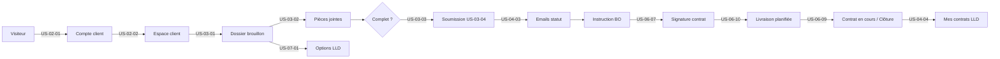
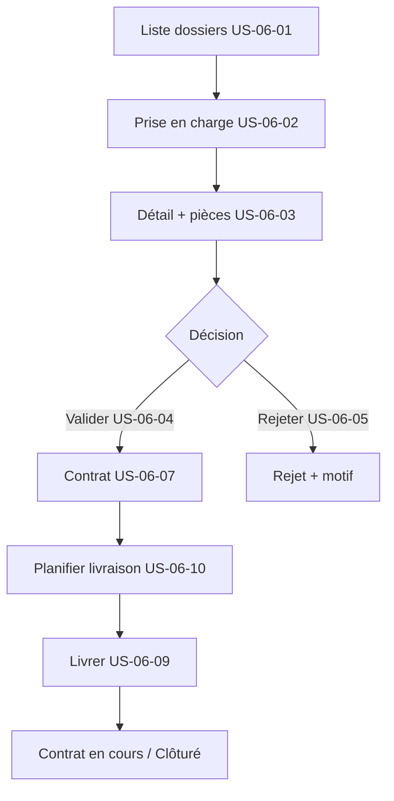

# Documentation développement — M-Motors LLD

Guide de synthèse du **développement fonctionnel et technique** du projet **M-Motors LLD** : parcours métier, rôles, cycle de vie des dossiers, épics implémentées et index vers les fiches détaillées.

Chaque user story possède sa **fiche dédiée** dans ce répertoire (endpoints, écrans, migrations, tests). Ce document **ne les remplace pas** : il en donne la vue d’ensemble et oriente la lecture.

**Documentation technique complémentaire :**

| Document | Contenu |
|----------|---------|
| [docs/backend/README.md](../backend/README.md) | API FastAPI, services, auth, tests |
| [docs/frontend/README.md](../frontend/README.md) | Next.js, App Router, composants |
| [docs/database/README.md](../database/README.md) | Schéma PostgreSQL, migrations |
| [docs/k8s/README.md](../k8s/README.md) | Déploiement Kubernetes |
| [docs/monitoring/README.md](../monitoring/README.md) | Observabilité, logs, alertes |
| [docs/cicd/README.md](../cicd/README.md) | GitHub Actions, secrets, déploiements |

---

## Sommaire

1. [Vue d’ensemble du produit](#1-vue-densemble-du-produit)
2. [Acteurs et rôles (RBAC)](#2-acteurs-et-rôles-rbac)
3. [Parcours métier global](#3-parcours-métier-global)
4. [Cycle de vie d’un dossier](#4-cycle-de-vie-dun-dossier)
5. [Épics et user stories](#5-épics-et-user-stories)
6. [Conventions de développement](#6-conventions-de-développement)
7. [Comment lire une fiche US](#7-comment-lire-une-fiche-us)
8. [Tests et qualité](#8-tests-et-qualité)
9. [Index des fiches](#9-index-des-fiches)

---

## 1. Vue d’ensemble du produit

**M-Motors LLD** est une application web de gestion de **Location Longue Durée** et d’**achat** de véhicules :

| Domaine | Description |
|---------|-------------|
| **Catalogue** | Véhicules en vente ou en LLD, photos, archivage |
| **Parcours client** | Inscription, dépôt de dossier, pièces jointes, suivi, signature, contrats |
| **Back-office** | Instruction, validation, rejet, livraison, reporting superviseur |
| **Options LLD** | Quatre options standard + catalogue back-office + avenants en cours de contrat |
| **Conformité** | Chiffrement PII, RBAC, audit trail, droit à l’effacement, SAST/DAST CI |

**Stack applicative :**

- **Frontend** : Next.js 15, TypeScript, Tailwind — `frontend/`
- **Backend** : FastAPI, SQLAlchemy, Alembic — `backend/`
- **Données** : PostgreSQL 16, MinIO/S3 (pièces, photos)
- **Emails** : Resend (notifications, liens magiques)
- **Local** : `docker-compose.yml` (db, minio, jaeger, api, ui)

---

## 2. Acteurs et rôles (RBAC)

Hiérarchie des rôles (inclusion croissante des droits) :

```text
client  →  gestionnaire  →  superviseur  →  admin
```

| Rôle | Périmètre principal |
|------|---------------------|
| **Client** | Ses dossiers, pièces, options LLD, signature, profil, effacement RGPD |
| **Gestionnaire** | Catalogue véhicules, instruction dossiers, validation/rejet, livraison |
| **Superviseur** | Tout le gestionnaire + reporting synthétique + dashboard contrats LLD en cours |
| **Admin** | Tout le superviseur + gestion utilisateurs/rôles + audit trail |

**Principes techniques :**

- Authentification **cookie HttpOnly** `access_token` (JWT) pour le navigateur.
- Vérification **rôle JWT = rôle en base** à chaque requête (`get_user_from_cookie`).
- Dépendances FastAPI : `require_gestionnaire`, `require_superviseur`, `require_admin`.

Détail complet : [US-11-03-rbac-moindre-privilege.md](./US-11-03-rbac-moindre-privilege.md).

---

## 3. Parcours métier global

### 3.1 Parcours client (B2C)



1. **Compte** — inscription sécurisée, confirmation email, connexion, mot de passe oublié, profil ([US-02](#épique-us-02--compte-client)).
2. **Dossier** — création depuis la fiche véhicule, brouillon multi-sessions, upload pièces, complétude, soumission ([US-03](#épique-us-03--dépôt-et-soumission-du-dossier)).
3. **Suivi** — tableau de bord, détail avec historique, notifications email ([US-04](#épique-us-04--espace-client)).
4. **Après validation** — signature électronique, livraison, contrats actifs, modification d’options ([US-06](#épique-us-06--back-office-dossiers-et-contrats), [US-07](#épique-us-07--options-lld)).

### 3.2 Parcours back-office



Parallèlement : **catalogue véhicules** ([US-05](#épique-us-05--catalogue-véhicules-back-office)), **options LLD** ([US-07](#épique-us-07--options-lld)), **reporting** et **contrats en cours** pour les superviseurs ([US-06-06](./US-06-06-reporting-dossiers.md), [US-06-11](./US-06-11-dashboard-contrats-en-cours.md)).

---

## 4. Cycle de vie d’un dossier

Statuts métier (`DossierStatusEnum` dans `backend/app/models/dossier.py`) :

| Statut API | Signification | Transitions typiques |
|------------|---------------|----------------------|
| `brouillon` | Dossier en cours de saisie | Création US-03-01 ; sauvegarde US-03-05 |
| `depose` | Soumis par le client | US-03-04 |
| `en_instruction` | Pris en charge par un gestionnaire | US-06-02 |
| `valide` | Legacy — validation sans enchaînement signature | Anciennes données |
| `en_signature` | Contrat généré, en attente signature client | US-06-04 / US-06-07 |
| `attente_livraison` | Contrat signé | US-06-07 |
| `livraison_planifiee` | Créneau fixé | US-06-10 |
| `contrat_en_cours` | LLD actif (après livraison) | US-06-09 |
| `cloture` | Terminé (achat à livraison ; LLD à échéance) | US-06-09 |
| `rejete` | Refus avec motif | US-06-05 |
| `annule` | Annulation métier | Selon règles métier |

```text
brouillon → depose → en_instruction → en_signature → attente_livraison
    → livraison_planifiee → contrat_en_cours → cloture
                              ↘ (achat) cloture directe après livraison
en_instruction → rejete
```

**Types de dossier :** `achat` | `lld` — impacte options, contrat, clôture et écrans « Mes contrats ».

---

## 5. Épics et user stories

Les identifiants **US-XX-YY** regroupent les livraisons par thème. Chaque lien pointe vers la fiche détaillée (API, UI, tests).

### Épique US-02 — Compte client

Authentification, profil et sécurité du compte.

| US | Titre | Fiche |
|----|-------|-------|
| US-02-01 | Inscription client sécurisée (CGU, email, pgcrypto) | [US-02-01.md](./US-02-01.md) |
| US-02-02 | Connexion et session (cookie JWT) | [US-02-02.md](./US-02-02.md) |
| US-02-03 | Réinitialisation mot de passe par email | [US-02-03.md](./US-02-03.md) |
| US-02-04 | Gestion du profil client | [US-02-04.md](./US-02-04.md) |

**Points clés :** validation mot de passe forte, confirmation email, messages d’erreur génériques au login, pages `/inscription`, `/connexion`, `/espace-client`.

---

### Épique US-03 — Dépôt et soumission du dossier

Parcours d’ouverture et de finalisation d’un dossier depuis le catalogue.

| US | Titre | Fiche |
|----|-------|-------|
| US-03-01 | Dépôt initial Achat / LLD depuis fiche véhicule | [US-03-01.md](./US-03-01.md) |
| US-03-02 | Upload des pièces justificatives (MinIO/S3) | [US-03-02.md](./US-03-02.md) |
| US-03-03 | Validation automatique de complétude | [US-03-03-validation-completude-dossier.md](./US-03-03-validation-completude-dossier.md) |
| US-03-04 | Soumission du dossier finalisé | [US-03-04.md](./US-03-04.md) |
| US-03-05 | Brouillon et complétion progressive (+ relances) | [US-03-05.md](./US-03-05.md) |

**Points clés :** référence `DOS-YYYY-NNNNN`, statut initial `brouillon`, stockage objet des pièces, règles de complétude avant `depose`.

---

### Épique US-04 — Espace client

Consultation et notifications côté client authentifié.

| US | Titre | Fiche |
|----|-------|-------|
| US-04-01 | Tableau de bord personnel | [US-04-01-tableau-de-bord-client.md](./US-04-01-tableau-de-bord-client.md) |
| US-04-02 | Détail dossier avec historique | [US-04-02-detail-dossier.md](./US-04-02-detail-dossier.md) |
| US-04-03 | Notification email à chaque changement de statut | [US-04-03-notification-email-changement-statut.md](./US-04-03-notification-email-changement-statut.md) |
| US-04-04 | Historique des contrats LLD actifs | [US-04-04-historique-contrats-lld.md](./US-04-04-historique-contrats-lld.md) |

**Points clés :** routes `/mes-dossiers`, emails Resend sur transitions, journal `DossierHistorique`, mensualité LLD (base + options).

---

### Épique US-05 — Catalogue véhicules (back-office)

Gestion de l’offre visible (ou archivée) par les gestionnaires.

| US | Titre | Fiche |
|----|-------|-------|
| US-05-01 | Ajout d’un véhicule au catalogue | [US-05-01-ajout-vehicule-catalogue.md](./US-05-01-ajout-vehicule-catalogue.md) |
| US-05-03 | Bascule Achat ↔ LLD | [US-05-03-toggle-lld.md](./US-05-03-toggle-lld.md) |
| US-05-04 | Archivage véhicule (soft delete) | [US-05-04-archivage-vehicule.md](./US-05-04-archivage-vehicule.md) |
| US-05-05 | Gestion des photos (galerie, principale, ordre) | [US-05-05-gestion-photos.md](./US-05-05-gestion-photos.md) |

**Points clés :** API `/api/v1/vehicules`, protection si dossiers en cours sur toggle LLD, stockage photos S3.

---

### Épique US-06 — Back-office dossiers et contrats

Instruction, décision, signature, livraison et pilotage superviseur.

| US | Titre | Fiche |
|----|-------|-------|
| US-06-01 | Tableau de bord dossiers en attente | [US-06-01-tableau-de-bord-dossiers.md](./US-06-01-tableau-de-bord-dossiers.md) |
| US-06-02 | Prise en charge d’un dossier | [US-06-02-prise-en-charge-dossier.md](./US-06-02-prise-en-charge-dossier.md) |
| US-06-03 | Détail dossier gestionnaire (pièces) | [US-06-03-dossier-bo-detail.md](./US-06-03-dossier-bo-detail.md) |
| US-06-04 | Validation d’un dossier | [US-06-04-validation-dossier.md](./US-06-04-validation-dossier.md) |
| US-06-05 | Rejet avec motif obligatoire | [US-06-05-rejet-dossier.md](./US-06-05-rejet-dossier.md) |
| US-06-06 | Reporting synthétique (superviseur) | [US-06-06-reporting-dossiers.md](./US-06-06-reporting-dossiers.md) |
| US-06-07 | Contrat et signature électronique | [US-06-07-contrat-signature.md](./US-06-07-contrat-signature.md) |
| US-06-08 | Avenant options LLD (contrat en cours) | [US-06-08-avenant-options-lld.md](./US-06-08-avenant-options-lld.md) |
| US-06-09 | Livraison et début / fin LLD | [US-06-09-livraison-debut-lld.md](./US-06-09-livraison-debut-lld.md) |
| US-06-10 | Planification de livraison | [US-06-10-livraison-planifiee.md](./US-06-10-livraison-planifiee.md) |
| US-06-11 | Dashboard contrats LLD en cours (superviseur) | [US-06-11-dashboard-contrats-en-cours.md](./US-06-11-dashboard-contrats-en-cours.md) |

**Points clés :**

- Route BO principale : `/backoffice/dossiers`
- API liste : `GET /api/v1/dossiers/backoffice`
- Gabarits Markdown : `backend/app/templates/contrat.md`, `avenant.md`
- Jobs planifiés : rappel fin de contrat (US-06-11), clôture LLD à échéance (US-06-09)

---

### Épique US-07 — Options LLD

Offre d’options et tarification sur tout le cycle de vie du contrat.

| US | Titre | Fiche |
|----|-------|-------|
| US-07-01 | Options LLD à la souscription (4 options standard) | [US-07-01-options-lld.md](./US-07-01-options-lld.md) |
| US-07-02 | Modification options sur contrat actif (client) | [US-07-02-options-lld-contrat-actif.md](./US-07-02-options-lld-contrat-actif.md) |
| US-07-03 | Catalogue options LLD (back-office) | [US-07-03-lld-catalog-backoffice.md](./US-07-03-lld-catalog-backoffice.md) |

**Options standard :** assurance, assistance, entretien, contrôle technique — surcoût mensuel HT recalculé dynamiquement.

**Lien US-06-08 :** modification en `contrat_en_cours` → avenant + signature (pas de changement immédiat sans accord).

---

### Épique US-11 — Sécurité, conformité et qualité

Transversal à toutes les fonctionnalités.

| US | Titre | Fiche |
|----|-------|-------|
| US-11-01 | Données personnelles chiffrées au repos (pgcrypto) | [us-11-01-pii-encryption-at-rest.md](./us-11-01-pii-encryption-at-rest.md) |
| US-11-03 | RBAC moindre privilège | [US-11-03-rbac-moindre-privilege.md](./US-11-03-rbac-moindre-privilege.md) |
| US-11-04 | Audit trail des mutations sensibles | [US-11-04-audit-trail.md](./US-11-04-audit-trail.md) |
| US-11-05 | Droit à l’effacement (RGPD) | [us-11-05-right-to-erasure.md](./us-11-05-right-to-erasure.md) |
| US-11-06 | SAST (Sonar) et DAST (OWASP ZAP) en CI | [us-11-06-sast-dast.md](./us-11-06-sast-dast.md) |

**Points clés :** table `audit_trail` immuable, soft delete client, empreinte email SHA-256, workflows `.github/workflows/sonarqube-pr.yaml` et `deploy-staging.yaml`.

---

## 6. Conventions de développement

### 6.1 Organisation du code

| Couche | Emplacement | Rôle |
|--------|-------------|------|
| Routes API | `backend/app/api/v1/endpoints/` | Orchestration HTTP, auth, validation |
| Schémas Pydantic | `backend/app/schemas/` | Entrées / sorties API |
| Modèles ORM | `backend/app/models/` | Entités PostgreSQL |
| Services métier | `backend/app/services/` | Logique réutilisable |
| Migrations | `backend/alembic/versions/` | Évolution schéma (**seule source de vérité** prod) |
| Pages Next.js | `frontend/src/app/` | Routes App Router |
| Composants UI | `frontend/src/components/` | Interface réutilisable |
| Tests backend | `backend/tests/unit/`, `integration/` | Pytest |
| Tests frontend | `frontend/tests/` | Jest |

### 6.2 Nommage des fiches US

- Préfixe **`US-XX-YY`** : épique + numéro dans l’épique.
- Fichiers en **kebab-case** descriptif ou identifiant court (`US-03-04.md`, `US-06-01-tableau-de-bord-dossiers.md`).
- Certaines fiches US-11 utilisent le préfixe minuscule `us-11-*.md` (même convention de contenu).

### 6.3 API et préfixe

- Préfixe global : **`/api/v1/`**
- Santé : `/api/healthz`, `/api/readyz` (hors instrumentation trace par défaut)
- Auth client : cookie **`access_token`** ; certains endpoints BO acceptent aussi les rôles staff

### 6.4 Démarrage local

```bash
# Stack complète
docker compose up -d

# Raccourcis Makefile (racine du dépôt)
make help
make migrate
make seed
make test-backend
make test-frontend
```

Variables : `backend/.env`, `frontend/.env.local` (voir `.env.example` respectifs).

### 6.5 Migrations

Toute évolution de schéma liée à une US doit passer par **Alembic** :

```bash
cd backend
alembic revision -m "description"
alembic upgrade head
```

Les fiches US citent souvent le numéro de révision (ex. `009_us_06_07`, `010_pg_dossier_status`).

---

## 7. Comment lire une fiche US

Chaque fichier de ce répertoire suit en général cette structure (sections variables selon la maturité de la livraison) :

| Section | Contenu typique |
|---------|-----------------|
| **Objectif** | Besoin métier / persona |
| **Critères d’acceptation / DoD** | Tableau critère → implémentation |
| **Endpoints API** | Méthode, route, paramètres, réponses, codes erreur |
| **Interface** | Routes Next.js, composants, parcours utilisateur |
| **Backend / Frontend** | Fichiers modifiés, modèles, services |
| **Migrations** | Révisions Alembic |
| **Tests** | Fichiers Pytest / Jest à exécuter |

**Workflow recommandé pour implémenter ou corriger une fonctionnalité :**

1. Lire la **fiche US** correspondante dans ce répertoire.
2. Consulter [docs/backend/README.md](../backend/README.md) ou [docs/frontend/README.md](../frontend/README.md) pour les patterns existants.
3. Vérifier le **modèle de données** dans [docs/database/README.md](../database/README.md).
4. Coder, ajouter **tests** (unitaires + intégration si API).
5. Mettre à jour la fiche US si le comportement livré diverge du document.

---

## 8. Tests et qualité

| Niveau | Où | Commande indicative |
|--------|-----|---------------------|
| Unitaires backend | `backend/tests/unit/` | `cd backend && pytest tests/unit -v` |
| Intégration API | `backend/tests/integration/` | `pytest tests/integration -v` (PostgreSQL requis) |
| Unitaires frontend | `frontend/tests/` | `cd frontend && npm test` |
| E2E | Playwright (frontend) | voir `frontend/package.json` |
| Sécurité CI | US-11-06 | Sonar sur PR, ZAP sur staging |

Les fiches US listent souvent les fichiers de test dédiés (`test_us_06_07_...`, `test_auth_...`).

**CI/CD :** workflows sous `.github/workflows/` — `ci.yaml`, `deploy-dev.yaml`, `deploy-staging.yaml`, `deploy-production.yaml`.

---

## 9. Index des fiches

Index alphabétique de toutes les fiches du répertoire (36 documents).

| Fichier | Épique | Résumé |
|---------|--------|--------|
| [US-02-01.md](./US-02-01.md) | US-02 | Inscription sécurisée |
| [US-02-02.md](./US-02-02.md) | US-02 | Connexion client |
| [US-02-03.md](./US-02-03.md) | US-02 | Mot de passe oublié |
| [US-02-04.md](./US-02-04.md) | US-02 | Profil client |
| [US-03-01.md](./US-03-01.md) | US-03 | Création dossier depuis véhicule |
| [US-03-02.md](./US-03-02.md) | US-03 | Upload pièces |
| [US-03-03-validation-completude-dossier.md](./US-03-03-validation-completude-dossier.md) | US-03 | Complétude avant soumission |
| [US-03-04.md](./US-03-04.md) | US-03 | Soumission finale |
| [US-03-05.md](./US-03-05.md) | US-03 | Brouillon multi-sessions |
| [US-04-01-tableau-de-bord-client.md](./US-04-01-tableau-de-bord-client.md) | US-04 | Dashboard client |
| [US-04-02-detail-dossier.md](./US-04-02-detail-dossier.md) | US-04 | Détail + historique |
| [US-04-03-notification-email-changement-statut.md](./US-04-03-notification-email-changement-statut.md) | US-04 | Emails de statut |
| [US-04-04-historique-contrats-lld.md](./US-04-04-historique-contrats-lld.md) | US-04 | Contrats LLD actifs |
| [US-05-01-ajout-vehicule-catalogue.md](./US-05-01-ajout-vehicule-catalogue.md) | US-05 | Création véhicule |
| [US-05-03-toggle-lld.md](./US-05-03-toggle-lld.md) | US-05 | Toggle Achat/LLD |
| [US-05-04-archivage-vehicule.md](./US-05-04-archivage-vehicule.md) | US-05 | Archivage soft delete |
| [US-05-05-gestion-photos.md](./US-05-05-gestion-photos.md) | US-05 | Galerie photos |
| [US-06-01-tableau-de-bord-dossiers.md](./US-06-01-tableau-de-bord-dossiers.md) | US-06 | Liste BO dossiers |
| [US-06-02-prise-en-charge-dossier.md](./US-06-02-prise-en-charge-dossier.md) | US-06 | Prise en charge |
| [US-06-03-dossier-bo-detail.md](./US-06-03-dossier-bo-detail.md) | US-06 | Détail BO |
| [US-06-04-validation-dossier.md](./US-06-04-validation-dossier.md) | US-06 | Validation |
| [US-06-05-rejet-dossier.md](./US-06-05-rejet-dossier.md) | US-06 | Rejet + motif |
| [US-06-06-reporting-dossiers.md](./US-06-06-reporting-dossiers.md) | US-06 | Reporting superviseur |
| [US-06-07-contrat-signature.md](./US-06-07-contrat-signature.md) | US-06 | Contrat + signature |
| [US-06-08-avenant-options-lld.md](./US-06-08-avenant-options-lld.md) | US-06 | Avenant options |
| [US-06-09-livraison-debut-lld.md](./US-06-09-livraison-debut-lld.md) | US-06 | Livraison effective |
| [US-06-10-livraison-planifiee.md](./US-06-10-livraison-planifiee.md) | US-06 | Planification livraison |
| [US-06-11-dashboard-contrats-en-cours.md](./US-06-11-dashboard-contrats-en-cours.md) | US-06 | Contrats en cours |
| [US-07-01-options-lld.md](./US-07-01-options-lld.md) | US-07 | Options à la souscription |
| [US-07-02-options-lld-contrat-actif.md](./US-07-02-options-lld-contrat-actif.md) | US-07 | Options contrat actif |
| [US-07-03-lld-catalog-backoffice.md](./US-07-03-lld-catalog-backoffice.md) | US-07 | Catalogue options BO |
| [us-11-01-pii-encryption-at-rest.md](./us-11-01-pii-encryption-at-rest.md) | US-11 | Chiffrement PII |
| [US-11-03-rbac-moindre-privilege.md](./US-11-03-rbac-moindre-privilege.md) | US-11 | RBAC |
| [US-11-04-audit-trail.md](./US-11-04-audit-trail.md) | US-11 | Audit trail |
| [us-11-05-right-to-erasure.md](./us-11-05-right-to-erasure.md) | US-11 | Droit à l’effacement |
| [us-11-06-sast-dast.md](./us-11-06-sast-dast.md) | US-11 | SAST / DAST CI |

---

*Document de synthèse — les fiches individuelles restent la référence détaillée pour chaque livraison. Dernière consolidation : 36 user stories couvrant les épics US-02 à US-07 et US-11.*
